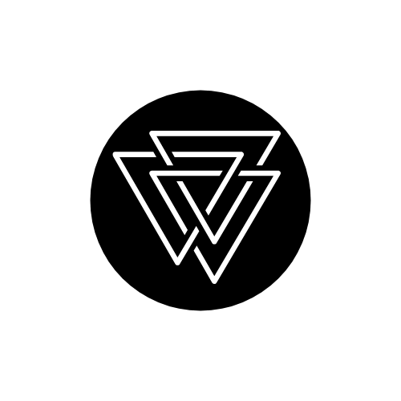

# Portfolio Project
### Portfolio project is the first project at Moringa school
### Its a static web page that contains a couple of items nameley:
1. *About*
 2. *Projects* 
3. *Playlists*
 
 ---
 ## *`About`*
 ### Sourcing from my social pages my about section is a brief paragraph
 ### It is partl true and partly cap for content purposes of my portfolio project
 ### To know about me follow me on my social platforms which I will link below 
 ---
 ## *`Projects`*
-  [Kay](https://github.com/raerodney/kaythemagician)
-  [Introvercey](https://github.com/raerodney/Introvercey)
-  [chacho play](https://github.com/raerodney/kaythemagician)

 ---
 ## *`Playlists`*
 ### This section features my favourite music from top Digital Service Providers
 ### It entails links from
 1. *Apple Music*
 2. *Deezer*
 3. *Spotify*
 ---
### It's definately not much much it gave me a chance to learn alot of new stuff such as embedding
### To track my progress please follow me om:
1. [Facebook](https://www.facebook.com/og.macmckinsley/)
2. [LinkedIn](https://www.linkedin.com/in/rodney-kinyua-13a471187/?lipi=urn%3Ali%3Apage%3Aprofile_view_index_index%3BlIcZcrQcS8i8JWjCiuVtrA%3D%3D)
3. [Github](https://github.com/raerodney)

